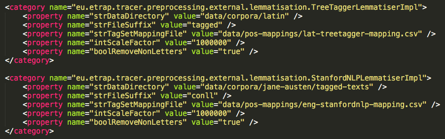

# Text preprocessing automation

One of the most recent developments of TRACER includes two preprocessing options to convert the output of the [_TreeTagger_](http://www.cis.uni-muenchen.de/~schmid/tools/TreeTagger/) and [_Stanford CoreNLP_](http://stanfordnlp.github.io/CoreNLP/) tools to TRACER's required input format, thus saving the user considerable preprocessing work. The figure below shows the corresponding preprocessing sections in TRACER's configuration file.



As you can see, each category has five properties. If you wish to import _TreeTagger_ and _Stanford CoreNLP_ files into TRACER you need to change the first two properties: the first property defines the file path, while the second defines the input file's extension. The third property, which must not be changed, contains the mapping instructions TRACER needs to convert input into output.To improve the usability of TRACER, a script is being developed to **drastically simplify the text preparation process**.

### TreeTagger

The experimental development generates TRACER-compatible `.txt` and `.lemma` files from _TreeTagger_ output, which means that the user does not have to prepare every text \(s\)he wants to analyse according to the 4-column TRACER format.


This automation currently **only** works with the **Brandolini** _**TreeTagger**_ **Latin parameter file**, designed to parse a mix of Classical and Medieval Latin. Support for the Medieval Latin parameter file trained on the Index Thomisticus Treebank is under-development. 


First, users run _TreeTagger_ on the texts they wish to analyse. The output file of _TreeTagger_ shoud have `.tagged` as a suffix, e.g.,: `author-title.tagged` The preferred file-naming convention is `00-author-title_of_work.tagged`. The naming convention helps TRACER generate the `.txt` file to be used for the analysis \(see below\). If there are multiple works to analyse, the numbering of the files should be sequential \(e.g., `01-`, `02-`, etc.\); digits, author and title should be separated by hyphens, and any white-space in the work title must be represented with an underscore.

Then, all `.tagged` files must be deposited in a tagged folder under TRACER's `/data/corpora/`directory, e.g.,: `/data/corpora/Bible/tagged/author-title.tagged`

Next, users now navigate to the main TRACER folder and type the following command:

```text
java -Xmx1g -Deu.etrap.medusa.config.ClassConfig=conf/tracer_config.xml -cp tracer.jar eu.etrap.tracer.preprocessing.external.lemmatisation.DeveloperTestClassLemmatisationMain
```

This command generates three files in the `/data/corpora/Bible/` folder: a `.txt` file containing all of the texts for TRACER to study \(already tokenised by sentence and sequentially ID'd\), a `.lemma-list` file containing all of the unique lemmas of all the texts under study, and a `.lemma` file containing all of the lemmas+pos tags of all texts under study.
TreeTagger uses a pipe to indicate lemma ambiguity, e.g., `wordForm PoS lemma1 | lemma2`. In these cases, the TRACER heuristic picks the most likely option based on the frequency in the corpus of `lemma1` and `lemma2` and on the number of incoming links from the inflected word form (`wordForm`).

Next, in the `tracer_config.xml` file, users add the paths to the `.txt` and `.lemma` files generated by TRACER.

Finally, users can now execute TRACER.


### Stanford CoreNLP

-conLL

