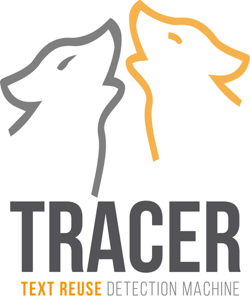
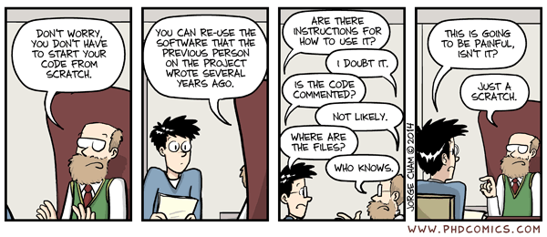

# About the manual

Logo by Emily Franzini.

## Authors

Greta Franzini, Emily Franzini, Kirill Bulert, Marco Büchler, Maria Moritz.

### Contributors

Mike Kestemont, José Luis Losada.

## Copyright

This manual is published under a **Creative Commons Attribution-ShareAlike 4.0 International License**.

## Syntax

**This manual is a work in progress.** It is regularly updated to improve clarity.

## Feedback

We greatly appreciate your feedback on this handbook. Your suggestions and comments will help us improve our documentation and adapt TRACER to your needs. There are two ways you can communicate improvements to this book: email us at **contact@etrap.eu** or post an issue over at this manual's GitHub repository: [https://github.com/gfranzini/tracer-manual/issues](https://github.com/gfranzini/tracer-manual/issues)

## Citation

You can cite this manual as follows:

Franzini, G., Franzini E., Bulert, K., Büchler M., Moritz, M. \(2016\) TRACER Text Reuse Detection Machine: The user manual. DOI: [https://tracer.gitbook.io/-manual/](https://gfranzini.gitbooks.io/tracer/content/)

## Version history

* Version 1.4 \(2019-06-14\): Updated troubleshooting section and R scripts for corpus preparation by José Luis Losada.
* Version 1.3 onwards \(2018-02-19\): Switched to Gitbook.
* Version 1.2 \(2017-05-23\): Updated version following a tutorial at the AIUCD \(Associazione per l’Informatica Umanistica e la Cultura Digitale\) Conference in Rome \[LaTeX\].
* Version 1.1 \(2016-09-09\): Updated version following a tutorial at the AIUCD \(Associazione per l’Informatica Umanistica e la Cultura Digitale\) Conference in Venice \[LaTeX\].
* Version 1.0 \(2016-08-25\): First version of the manual \[LaTeX\].

