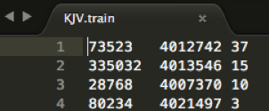
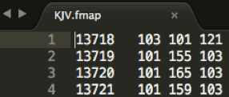
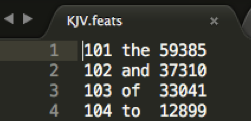

# Step 2. Featuring/Training

Now that we’ve preprocessed the text, we can proceed to breaking it down into units or _features_ that can be compared \(e.g. words, bigrams, trigrams\). For this reason, this step is known as _Featuring_ or _Training_. The chart below provides an overview of _Featuring_. TRACER can perform two types of featuring, _Syntactic_ and _Semantic_. _Syntactic_ dependency parsing is not always accurate because parsers \(and the TRACER parser\) are not yet able to infer dependencies. But if TRACER takes manually annotated data from treebanks, for example, then the parser would be able to produce usable results.

> **\[warning\] To update**
>
> Explain SEMANTIC DEPENDENCY PARSING

As you can see, there exists also a third type of _Featuring_ implementation, _Non-statistic Approaches_. These aren’t part of TRACER. Among these, _Verba dicendi_ featuring could be used for fragmentary texts but it’s not a stable feature; _Surface Features_, for example quotation marks, are also an unstable feature as they don’t always occur in historical texts; for _Canonical References_, please consult the research of [Dr Matteo Romanello](https://www.researchgate.net/profile/Matteo_Romanello); for _Signal Processing_ see [Seo and Croft \(2008\)](../references.md).

## Features

TRACER supports 10 different features or featuring units, from words as features to 10-gram features. Generally, features of 3-4 grams are sufficient for text reuse analyses. The _n_ in 'n-gram' could be a character or a word.

* **Word-based featuring**: good for paraphrase detection. With this type of featuring one should also lemmatise and activate synonym replacement.
* **Bigram featuring**: good to detect verbatim and near-verbatim text reuse. Lemmatisation and synonym replacement with this N-gram approach might not work or be necessary.
* **Trigram featuring**: good to detect verbatim and near-verbatim text reuse. Lemmatisation and synonym replacement with this N-gram approach might not work or be necessary.

### Feature density

The _Selection_ step in TRACER asks users to define a _Feature density_ for every detection task. By default TRACER sets the feature density to 0.5 \(=50%\), meaning that it will return only reuse pairs that are at least 50% similar or \(share 50% of their features\). For more information about Feature density, see [Step 3. Selection](step-3.-selection.md).

## Types of Featuring

### Overlapping

An overlapping type of featuring is _**shingling**_, a process typically used to detect near-verbatim reuse. In NLP or text mining, a shingle is an _n_-gram and the process of shingling creates a sequence of overlapping tokens in a document. Below are some examples of shingling.

Example sentence: _I have a very big house_

**Bigramshingling**  
\(_bigram_ = an _n_-gram of size 2\)  
\(I have\), \(have a\), \(a very\), \(very big\), \(big house\)  
Feature 1 = `I have`  
Feature 2 = `have a`  
Feature 3 = `a very`  
Feature 4 = `very big`  
Feature 5 = `big house`

**Trigramshingling**  
\(_trigram_ = an _n_-gram of size 3\)  
\(I have a\), \(have a very\), \(a very big\), \(very big house\)  
Feature 1 = `I have a`  
Feature 2 = `have a very`  
Feature 3 = `a very big`  
Feature 4 = `very big house`

**Tetragram shingling**  
\(_tetragram_ = an _n_-gram of size 4\)  
\(I have a very\), \(have a very big\), \(a very big house\)  
Feature 1 = `I have a very`  
Feature 2 = `have a very big`  
Feature 3 = `a very big house`

Shingling creates more and bigger features, so your detector will need more time to compute similarity.

### Non-overlapping

A non-overlapping type of featuring is _**hash-breaking**_, a process typically used to detect duplicates or exact copies. Hash-breaking creates features with no overlap. Below are some examples of hash-breaking.

Example sentence: _I have a very big house_

**Bigram hash-breaking**  
\(_bigram_= an _n_-gram of size 2\)  
\(I have\), \(a very\), \(big house\)  
Feature 1 = `I have`  
Feature 2 = `a very`  
Feature 3 = `big house`

**Trigram hash-breaking**  
\(_trigram_ = an _n_-gram of size 3\)  
\(I have a\), \(very big house\)  
Feature 1 = `I have a`  
Feature 2 = `very big house`

### Distance-based

The _Distance-based Bigram_ can be used to improve retrieval performance. Distance-based bigrams are good for detecting paraphrases or reuse that is not 100% literal. The Distance-based bigram is a word pair whose distance between the two components is ≥ 1.

Example sentence: _I have a big house_

**Bigram**  
`I have 1` where 1 describes the distance between ‘I’ and ‘have’ \(one word\)  
`have a 2` where 2 describes the distance between ’I’ and ’a’  
`a big 3` where 3 describes the distance between ‘I’ and ‘big’  
`big house 4` where 4 describes the distance between ‘I’ and ‘house’

### Shingling or hash-breaking?

Let us assume you’re attempting to find the following string:

`ABCDE`

in the following reuse units:

1. `GHABCDELM`  
2. `NABCDEXYZ`

What would be the best algorithm to do so, _shingling_ or _hash-breaking_? Let’s compare these two methods.

#### Hash-breaking

If we use hash-breaks of 2 features the similarity detection in string 2 won’t work because we break the reuse units the wrong way:  
`AB CD E$`  
`NA BC DE XY Z$`

As you can see, the `AB` feature in string 2 is split between `NA` and `BC`. For string 1, on the other hand, hash-breaking works:  
`AB CD E$`  
`GH AB CD DE LM`  
In this case the breaks allow us to find the reuse.

#### Shingling

Both bigram and trigram shingling work to detect the example reuse above in strings 1 and 2. It doesn’t matter what method we use. What changes, however, is _performance_.

## Customising parameters or _properties_

In TRACER, the featuring settings can be changed in the `tracer_config.xml`.

Let’s assume we want to change the above property in order to run trigram shingling on the text. The changed property will look like this:

We save the document and rerun TRACER. This reuse detection task produces a number of files, including:

**KJV.meta**

This file provides a human-readable overview of the trigram shingling training.

**KJV.train**

This file is organised as follows:  
`FEATURE ID - REUSE UNIT ID - POSITION IN REUSE UNIT`

**KJV.fmap**

This file provides a map or breakdown of each feature:  
`FEATURE ID - WORD ID - WORD ID - WORD ID`

**KJV.feats**

This document is the word index, where words are sorted by frequency:  
`WORD ID - WORD - FREQUENCY`

If you look at the _Training_ default property in TRACER’s `tracer_config.xml`, you’ll notice that the trigram shingling training we’ve done is _syntactic_. TRACER also contains a _semantic_ featuring property, immediately preceding the syntactic property \(Figure below\). This property is commented out by default but can be enabled by removing the comment syntax \(`<!-....->`\).

For semantic training, TRACER looks at words and co-occurrences.

