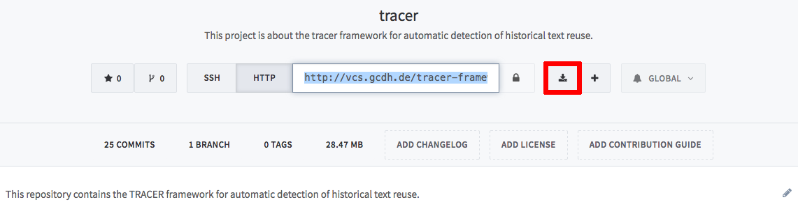

# Download and installation

## Download and installation 

TRACER needs between 5GB and 10GB of total space \(including result files\). It is therefore important that you locate a folder on your computer with 10GB of space in which TRACER can be installed and computed. Do not store and run TRACER on a USB drive as this will result in very slow computing times.

You can download or clone the most recent release of TRACER from [its GitLab repository](http://vcs.etrap.eu/users/sign_in) by creating a free GitLab account. **However, please be aware that the most recent version might be unstable**.

Git is a so-called _version control system_ that tracks file changes. It is heavily used by software developers and teams who collaborate on the same project. If Git is not already installed on your machine, you can get a copy for your operating system from the [official homepage](https://git-scm.com/downloads). After installation, and to run Git, you must prefix commands in your terminal with `git`. An example is `git status`, which shows pending changes and suggests potential next steps.

To get a copy of TRACER’s repository you first need to clone it. This is done by typing the following into your terminal:

`git clone http://vcs.etrap.eu/tracer−framework/tracer.git`

You’ll be prompted for your GitLab username and password, and a new folder will appear on your screen if the repository is successfully cloned. Before you can start working with TRACER you first have to build it from the source. Using the terminal, change into the TRACER directory and execute the command `ant`. If you get a `BUILD FAILED` message some of the requirements haven’t been met.

The recommended Git workflow is to first create a new branch or copy of the TRACER repository by typing:

`git checkout−b <your branchname>`

You’re now on a new local branch and all changes done to the files will only remain in this local branch. You can get an overview of all branches by typing:

`git branch −a`

And you can switch branches in the same way you created one. The original branch is always called `master`. If you switch branches the tracked files will change according to your branch, while untracked files will remain in all branches. If you already built TRACER, you can type `git status` and see that some untracked files were created by the build process. If you want to obtain the newest version of TRACER just switch to the master branch and type:

`git pull`

This will download the latest changes into your master branch. Remember not to work on the master branch unless you’re familiar with Git.

### Contributing

Before contributing to the TRACER code please read the [`git commit`](http://vcs.etrap.eu/users/sign_in) conventions. With your account you also received the right to create your own branches and merge requests in GitLab. Please create a merge request if you want to contribute to TRACER.

### Reporting

With your account you also have the ability to create new issues. If you encounter a bug or are in need of a feature please create a new issue in GitLab or Redmine. **If you find a bug, please always provide your build number** \(which you can find your TRACER's `build.xml` file\).

## Compiling TRACER 

To compile TRACER, please navigate to the TRACER folder containing the `build.xml` file, which includes all instructions on how to create the executable TRACER program. To compile the software, in the command line type:

`ant`

And press `ENTER`. This starts the build process. Depending on the disc type and the file system, this process can take between five and twenty seconds. Once the build process is complete, the `tracer.jar`file is created. The`.jar` file is TRACER’s executable program and currently measures 33MB in size.

TRACER’s build file `build.xml` contains a number of targets that aren’t executed in order to speed up the build process. However, you can visualise all targets by typing:

`ant −p verbose`

which lists, among others, TRACER's Javadoc. If you now type:

`ant javadoc`

you’ll create TRACER’s Javadoc in the folder `doc/web/javadoc/Tracer-1.0/`. There, click on the `index.html` file to view the Javadoc in a web browser.

