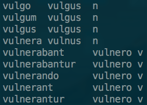

# PoS-tagging, lemmatisation & WordNets

In order to detect text reuse, TRACER also requires linguistic information pertaining to the language you're examining. These are:

### A _lemma_ file...

...listing all word-forms present in the text, their base-form and word-class or part-of-speech tag. This information can be automatically extracted using a morphological analyser that is able to read the language you wish to analyse.

The output file produced by your morphological analyser of choice needs to be converted to TRACER's input format. TRACER takes three columns, separated by `TAB`s: a column listing the _word-forms_ as they appear in the text; a column providing the _base-form_ or dictionary entry of every word-form; and a third column with the relative _word-class_ \(verb, noun, etc.\):



### a _synonyms_ file...

...listing all dictionary entries for your particular language along with their synonyms. In other words, a thesaurus. You can extract these lists from [wordnets](http://globalwordnet.org/wordnets-in-the-world/) if available for the language you are working with. While wordnets typically display this information as `lemma synonym1, synonyms2, synonym3, ...` \(one line per lemma\), TRACER requires a bidirectional two-column list, such as:


The figure above displays one synonym per lemma. For lemmas with multiple synonyms the file should be structured as follows:

```text
lemma1   synonym1
lemma1   synonym2
lemma1   synonym3
```

And should be bidirectional:

```text
lemma1      synonym1
synonym 1   lemma 1
```

**If you wish to detect non-verbatim text reuse \(e.g. paraphrase\) you need** _**both**_ **the lemma and the synonyms files. If you're only interested in word-for-word text reuse, you don't need the lemma and synonym files.**  
The `.txt`, `.lemma` and, optionally, the `.synonyms` files must be deposited in TRACER's `corpora` directory and declared in the `tracer_config.xml` file, as shown below.


If you don't use a `.syns` file, you needn't delete the `SYNONYMS_FILE_NAME` property but must declare this in the _Word-level Preprocessing_ section of TRACER's configuration file.

## 

