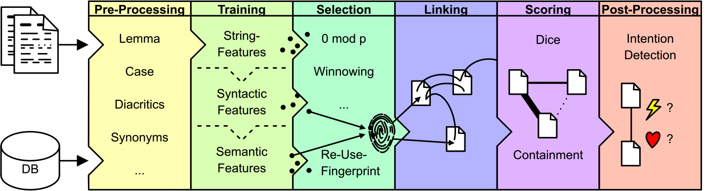
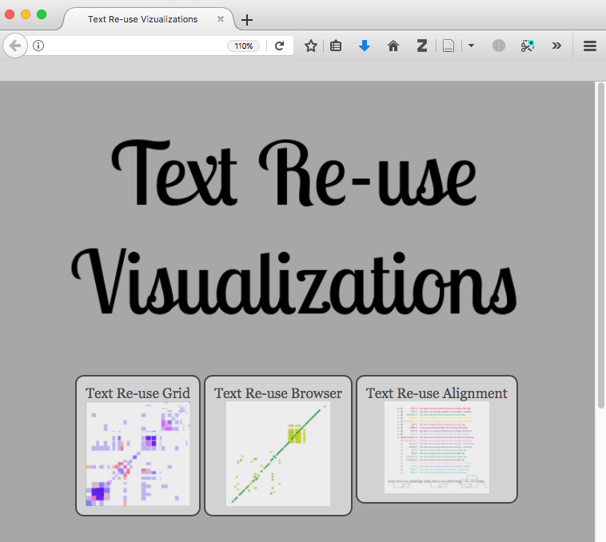
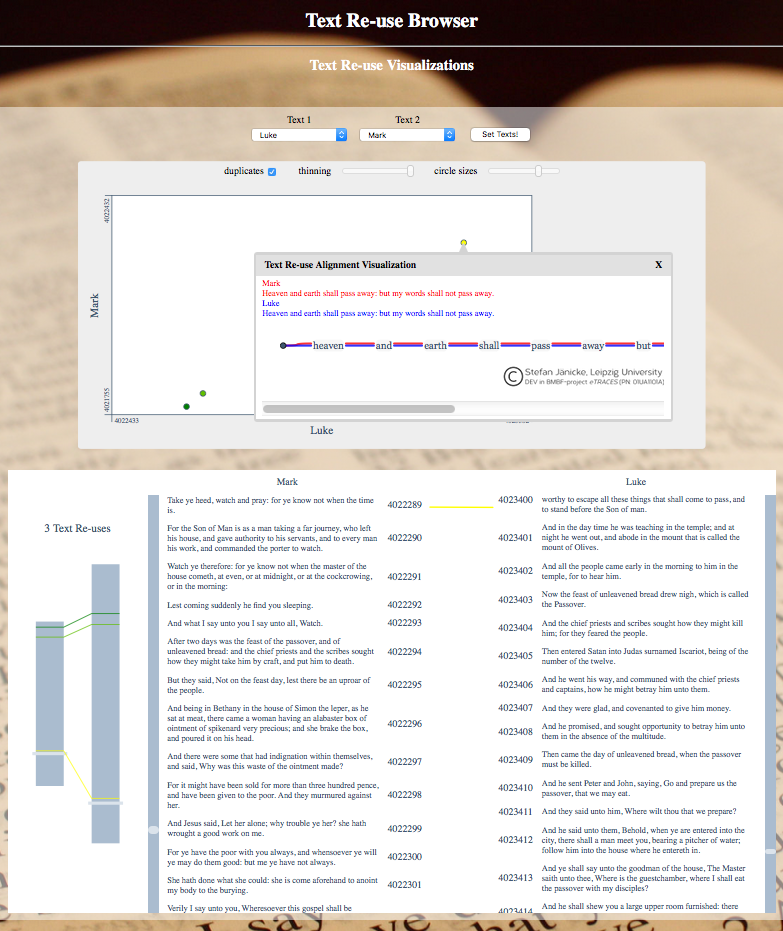

# Postprocessing

TRACER integrates a variant graph visualisation tool called [TRAViz](http://www.traviz.vizcovery.org/) in order to visualise the reuse results in a more legible format. TRAViz provides different types of visualisations for both close and distant reading, including dot-plots and text-alignments. To view the computed results, navigate to the `TRACER_DATA` folder and locate the relevant results sub-folder therein. Clicking through the various sub-folders should eventually lead you to a TRAViz folder in which you’ll find an `index.html` file. Double-click on `index.html` and your browser should now show this:

Here, the user can explore three different visualisations of the results:

> **\[warning\] To update**
>
> The Text Reuse Grid

1. The _Text Reuse Browser_ compares two works or texts only.
2. The _Text Reuse Alignment_ compares multiple texts. 

Select your texts from the drop-down menus and click on `Set Texts!`. You should now see two visualisations. In both visualisations, the greener the colour the more similar the matches. The first visualisation is a dot-plot or distant reading view, typically used in plagiarism detection; on the Y axis we have the gospel of Mark and on the X axis Luke. The length of the axes correspond to the length of the work, and what we can immediately observe is that Mark's gospel is shorter than Luke’s. The numbers you see on the axes correspond to the IDs of the first and last sentences in each gospel. Each axis is made up of points, each corresponding to a sentence. The dots in the white area pinpoint similarities between the two texts and their colour the degree of similarity. The bottom plot offers a close reading exploration of the reuse alignments. The left pane gives you a macro-view, where the two grey rectangles represent Mark and Luke’s gospels. The connecting lines join similar sentences and give you their exact location within the work. The right pane offers a micro-view of the data, allowing you to compare alignments. Play with the visualisation and try to interpret the results!

