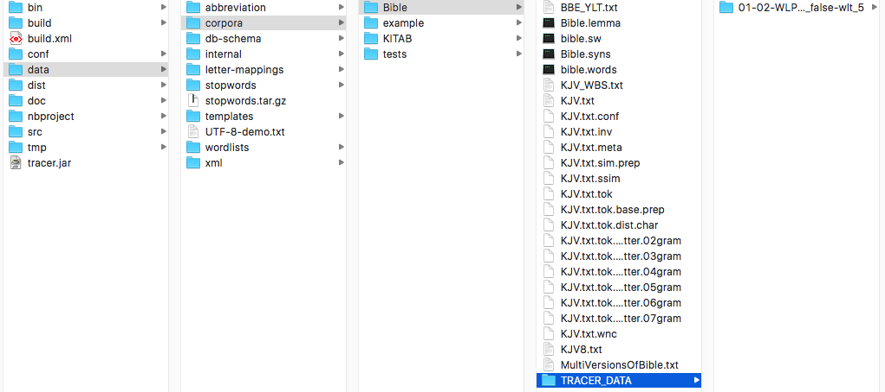
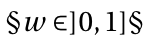

# Results & computed files

For every detection task TRACER computes a number of files, including, [as previously seen](configuration/step-5.-scoring.md), the text reuse results in a `.score` file. This page describes all of these.

## Where to find TRACER results

The results of every TRACER run are automatically stored in a newly generated folder called `TRACER_DATA` under TRACER's `data > corpora > Bible`:

If you’re working with your own texts –not TRACER’s default Bible data– the `TRACER_DATA` folder would be created in your specified directory \(e.g. `data > corpora > MyTexts`\).

TRACER organises the results in a deep folder structure with long folder names that describe the parameters used for a particular analysis. For every new analysis, TRACER creates a separate folder.

The folder name in the Figure above reads as follows:

`01-02-WLP-lem_true_syn_true_ssim_false_redwo_false-ngram_5-LLR_true_toLC_false_rDia_false_w2wl_false-wlt_5`  
Let's break it down:

| Abbreviation in folder name | Meaning of abbreviation |
| :--- | :--- |
| `01-02-WLP-` | Preprocessing step \(01\)-word-level \(02\)-Word Level Processing |
| `lem_true_` | Lemmatisation ENABLED |
| `syn_true_` | Synonym replacement ENABLED |
| `ssim_false_` | Replace String Similar words DISABLED |
| `redwo_false-ngram_5-LLR_true_` | Reduced words option DISABLED-to the most significant 5 letter ngram-significance is measured by the Log-Likelihood Ratio ENABLED |
| `toLC_false_` | Everything to lower case DISABLED |
| `rDia_false_` | Remove diacritics DISABLED |
| `w2wl_false-wlt_5` | Replace word by word length DISABLED-For words of 5 letters or more |

This folder represents the first step in your detection task, _Preprocessing_. The other five steps of the detection process are all nested within this folder. So, if you open the _Preprocessing_ folder, you’ll find the second folder in the sequence, the _Featuring/Training_ folder. Within the _Featuring/Training_ folder, you’ll find the _Selection_ folder, and so on until you reach the final _Scoring_ folder. In each and every folder you’ll find the relevant files resulting from the settings you specified in the `tracer_config.xml` file.

### 1. Computed files in Preprocessing

#### `.inv`

`inv` stands for _inverted list_. This file works like a word index and is the heart of any retrieval system. It shows you the position of a given word in a given textual segment/unit. For example, the row `114 4003870 2` in an `.inv` TRACER file means that word `114` can be found in segment `4003870` in position `2`.

#### `.wnc`

`wnc` stands for _words number complete_. This file provides a list of all the types in the corpus, including rank, word length and frequency. The list and the IDs are frequency-sorted.

`RANK WORD LENGTH FREQUENCY`

#### `.meta`

This file provides an overview \(the "metadata" as it were\) of the corpus segmentation:

* `SENTENCES`: lines.
* `WORD_TYPES`: number of unique words as dictionary entries.
* `WORD_TOKENS`: occurrences of a word; every word in a text, no matter how many times it occurs.
* `SOURCES`: for example, a book.
* `SSIM_THRESHOLD`: degree of similarity required to consider two words as similarly written.
* `SSIM_EDGES`: number of links or word pairs satisfying the similarity requirements stated in `SSIM_THRESHOLD`.
* `BOW_WORD_TOKENS`: tokens or unique words that appear in a line.

#### `.tok`

This file is a _tokenized_ version of the source text. This means that all punctuation has been removed or separated from the word \(depending on the settings\). The default setting in TRACER is `delete`.

#### `.tok.dist.char`

This file displays the distribution of the characters across the corpus. This file is useful to clean up overlooked dirt in the text\(s\) under analysis. If the file contains an unexpected character, thanks to the `.char` information the user can more easily identify and remove it from the text\(s\).

#### `.tok.dist.letter.02gram`

This file displays the distribution of letter bigrams across the corpus.

#### `.ssim`

Everything comes together in this file. The first and second columns represent the two words; the third column is the overlap of letter bigrams; the fourth column is the weighted overlap `§w§` between:

by [Broder’s Resemblance](http://www.cs.princeton.edu/courses/archive/spr05/cos598E/bib/broder97resemblance.pdf) measure.


Update.


### 2. Computed files in Featuring/Training

#### `.feats`


Update.


`WORD-ID WORD FREQUENCY`

#### `.train`

This file contains three columns of data:

`FEATURE-ID REUSE-ID POS`

Where:

`FEATURE-ID` = see below.  
 `REUSE-ID` = ID from the input file, first column.  
 `POS` = position of the feature in the reuse under `REUSE-ID`. In the case of n-grams as features the position is always that of the first word in the n-gram.

#### `.fmap`

This two-column file maps the feature ID from the `.train` file to the word\(s\) that make up that feature. Specifically, if you are using words as features, the numbers will be identical. If, instead, you are using n-grams, the second column contains the IDs of each word in the n-gram\).

`FEATURE-ID WORD(s)-ID(s)`

### 3. Computed files in Selection

The `.sel` file is the same as the `.train` file only without the removed words.


Update.


### 4. Computed files in Linking


Update.


### 5. Computed files in Scoring

The `.score` file contains all computed reuse pairs. The first two columns list the IDs of the aligned reuse units, the third column displays the number of shared features \(absolute overlap\) and the fourth column the degree of similarity \(weighted overlap\). A similarity of `0.1` is 10%, of `0.2` is 20% and so on until `1` = 100%. In the example below, the two sentences have two features in common for a total similarity of 50%:

`1101991 1300887 2.0 0.5`

**NB:** The `.score` file lists results bidirectionally and thus redundantly. The two results below, for example, represent the same reuse alignment but the order of the IDs is inverted:

`1102581 1300887 2.0 0.5`  
`1300887 1102581 2.0 0.5`

