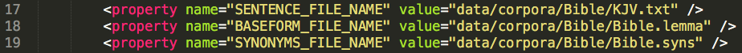

# PoS-tagging, lemmatisation & WordNets

In order to detect text reuse, TRACER also requires linguistic information pertaining to the language you're examining. These are:

#### A _lemma_ file...

...listing all word-forms present in the text, their base-form and word-class or part-of-speech tag. This information can be automatically extracted using a morphological analyser that is able to read the language you wish to analyse.

The output file produced by your morphological analyser of choice needs to be converted to TRACER's input format. TRACER takes three columns, separated by `TAB`s: a column listing the _word-forms_ as they appear in the text; a column providing the _base-form_ or dictionary entry of every word-form; and a third column with the relative _word-class_ \(verb, noun, etc.\):


#### a _synonyms_ file...

...listing all dictionary entries for your particular language along with their synonyms. In other words, a thesaurus. You can extract these lists from [wordnets](http://globalwordnet.org/wordnets-in-the-world/) if available for the language you are working with. While wordnets typically display this information as `lemma  synonym1, synonyms2, synonym3, ...` \(one line per lemma\), TRACER requires a bidirectional two-column list, such as:


The figure above displays one synonym per lemma. For lemmas with multiple synonyms the file should be structured as follows:

```
lemma1   synonym1
lemma1   synonym2
lemma1   synonym3
```

And should be bidirectional:

```
lemma1      synonym1
synonym 1   lemma 1
```

**If you wish to detect non-verbatim text reuse \(e.g. paraphrase\) you need **_**both**_** the lemma and the synonyms files. If you're only interested in word-for-word text reuse, you don't need the lemma and synonym files.**  
The `.txt`, `.lemma` and, optionally, the `.synonyms` files must be deposited in TRACER's `corpora` directory and declared in the `tracer_config.xml` file, as shown below.



If you don't use a `.syns` file, you needn't delete the `SYNONYMS_FILE_NAME` property but must declare this in the_ Word-level Preprocessing_ section of TRACER's configuration file.

### Can the formatting be automated?

For the `.syns` file, TRACER currently doesn't provide any means of automating the column-formatting.

For the `.lemma` file, the latest release of TRACER provides automatic column-formatting for files analysed with the _TreeTagger_ and _Stanford CoreNLP_ morphological analysers \(see below\).

### TRACER support for _TreeTagger_ and _Stanford CoreNLP_

One of the most recent developments of TRACER includes two preprocessing options to convert the output of the [_TreeTagger_](http://www.cis.uni-muenchen.de/~schmid/tools/TreeTagger/) and [_Stanford CoreNLP_](http://stanfordnlp.github.io/CoreNLP/) tools to TRACER's required input format, thus saving the user considerable preprocessing work. The figure below shows the corresponding preprocessing sections in TRACER's configuration file.


As you can see, each category has five properties. If you wish to import _TreeTagger_ and _Stanford CoreNLP_ files into TRACER you need to change the first two properties: the first property defines the file path, while the second defines the input file's extension. The third property, which must not be changed, contains the mapping instructions TRACER needs to convert input into output.

