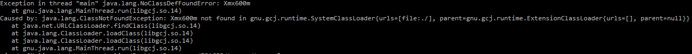

# Java lang no class definition found

This error appears if the version of Java installed on your computer is not the one required by TRACER, which is Java 8. To fix the error, download and install Java 8. Once installed, open the terminal and type `java -version` and press `ENTER` to check you have the correct version installed; the version number should start with a `1` and the second number should be an `8`. If your second number is not `8`, then installation of Java 8 was not successful.

Once Java 8 is installed on your computer you can re-run TRACER.

