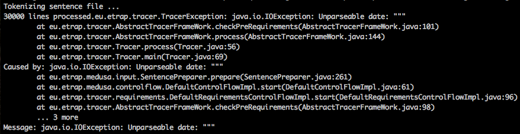

# Unable to parse date

This error is caused by the presence of a sequence of characters or absence of text in the **second column** of the corpus file. The term `date` is misleading and does not, in this case, indicate that the problem is with dating information \(which can be added in the third column of the corpus file\). The problem here is that TRACER does not provide information about the specific issue with the text, so the user has to check the corpus file in a text editor and correct anything that might seem incorrect or problematic. In order to fix this error, the user has to correct, save and re-run TRACER. If the error persists, then more corpus cleaning is needed.

